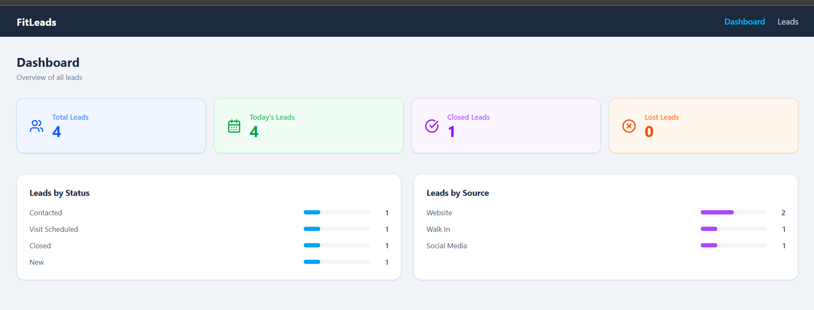
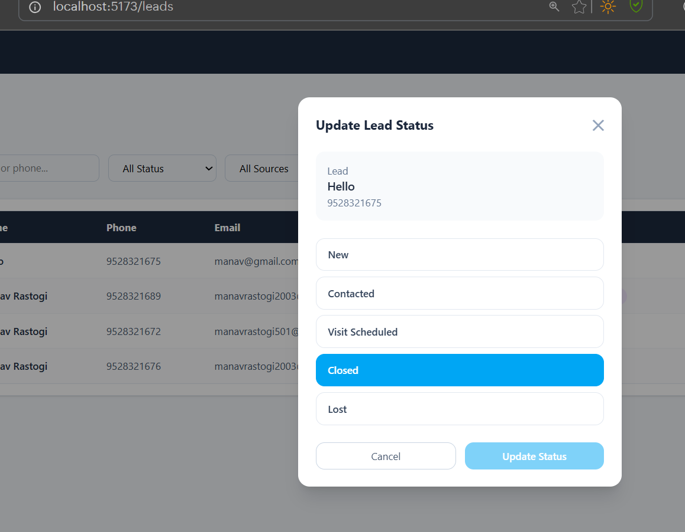
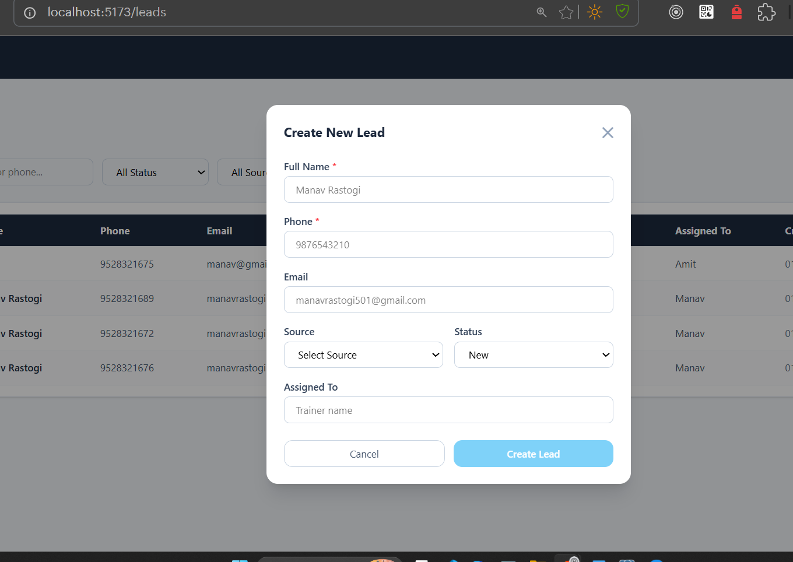
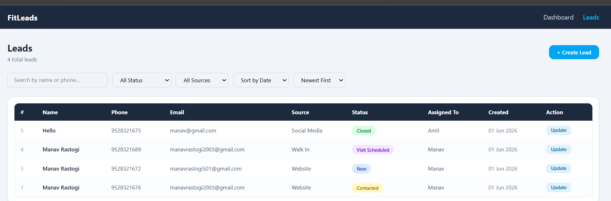

```markdown
# FitLeads - Lead Management System

A full-stack Lead Management Module built for a fitness company.
Built with Node.js, Express, PostgreSQL, and React.js.

---

## Tech Stack

- **Backend:** Node.js, Express.js
- **Database:** PostgreSQL
- **Frontend:** React.js, Tailwind CSS, Vite
- **Validation:** Joi
- **Others:** Axios, React Hot Toast, React Router DOM

---

## Project Structure

```
Assignments/
├── backend/
│   ├── src/
│   │   ├── config/         # DB connection
│   │   ├── controllers/    # Request/response handlers
│   │   ├── middlewares/    # Validation & error handling
│   │   ├── routes/         # API routes
│   │   ├── services/       # DB queries
│   │   ├── validations/    # Joi schemas
│   │   └── app.js
│   ├── database/
│   │   └── schema.sql      # Table + indexes
│   ├── .env.example
│   └── server.js
│
└── lead-management-frontend/
    ├── src/
    │   ├── api/            # Axios config
    │   ├── components/     # Reusable components
    │   ├── pages/          # Dashboard & Leads pages
    │   └── App.jsx
```
## Screenshots

### Dashboard


### Leads List


### Create Lead


### Update Status

---

## Getting Started

### Prerequisites

- Node.js v20+
- PostgreSQL v14+
- npm

---

### Backend Setup

**1. Clone the repository**
```bash
git clone https://github.com/ManavRastogi03/lead-management.git
cd lead-management/backend
```

**2. Install dependencies**
```bash
npm install
```

**3. Setup environment variables**
```bash
cp .env.example .env
```

Edit `.env` with your values:
```env
PORT=5000
DB_HOST=localhost
DB_PORT=5432
DB_USER=postgres
DB_PASSWORD=your_password
DB_NAME=lead_management
```

**4. Create database**
```bash
psql -U postgres -c "CREATE DATABASE lead_management;"
```

**5. Run schema (creates table + indexes)**
```bash
psql -U postgres -d lead_management -f database/schema.sql
```

**6. Start the server**
```bash
# Development
npm run dev

# Production
npm start
```

Server runs on: `http://localhost:5000`

---

### Frontend Setup

**1. Go to frontend folder**
```bash
cd lead-management-frontend
```

**2. Install dependencies**
```bash
npm install
```

**3. Create `.env`**
```env
VITE_API_BASE_URL=http://localhost:5000/api
```

**4. Start the frontend**
```bash
npm run dev
```

Frontend runs on: `http://localhost:5173`

---

## API Endpoints

| Method | Endpoint | Description |
|--------|----------|-------------|
| GET | /health | Health check |
| POST | /api/leads | Create a new lead |
| GET | /api/leads | List leads (search, filter, sort, paginate) |
| PUT | /api/leads/:id/status | Update lead status |
| GET | /api/dashboard | Dashboard metrics |

---

### Query Parameters for GET /api/leads

| Param | Type | Description | Default |
|-------|------|-------------|---------|
| page | number | Page number | 1 |
| limit | number | Records per page | 10 |
| search | string | Search by name or phone | - |
| status | string | Filter by status | - |
| source | string | Filter by source | - |
| sort_by | string | created_at, full_name, status | created_at |
| order | string | asc or desc | desc |

---

### Lead Status Flow

```
new → contacted → visit_scheduled → closed / lost
```

---

### Allowed Values

**Status:** `new`, `contacted`, `visit_scheduled`, `closed`, `lost`

**Source:** `website`, `referral`, `walk_in`, `social_media`, `other`

---

## Database Optimization Strategy

The system is designed to handle **10 lakh+ records** efficiently.

### Indexes Added

| Index | Column | Purpose |
|-------|--------|---------|
| idx_lead_full_name | full_name | Speeds up ILIKE name search |
| idx_lead_phone | phone | Fast unique phone lookup |
| idx_lead_status | status | Fast status filtering |
| idx_lead_source | source | Fast source filtering |
| idx_lead_created_at | created_at | Fast date range queries for dashboard |
| idx_lead_status_source | status + source | Composite index for combined filters |

### Other Optimizations

- **Connection Pooling** — `pg.Pool` with max 10 connections reuses DB connections instead of creating new ones per request
- **Parameterized Queries** — `$1, $2` prevents SQL injection and allows query plan caching by PostgreSQL
- **Pagination** — `LIMIT` + `OFFSET` ensures we never load all records into memory
- **Promise.all()** — Dashboard runs all 4 queries in parallel instead of sequentially
- **ILIKE with %search%** — Case-insensitive search without full table scan when index is used
- **stripUnknown: true** — Joi strips unknown fields before they reach the DB

---

## Sample API Requests

**Create Lead**
```json
POST /api/leads
{
  "full_name": "Manav Rastogi",
  "phone": "9876543210",
  "email": "manav@gmail.com",
  "source": "website",
  "status": "new",
  "assigned_to": "Trainer A"
}
```

**Update Status**
```json
PUT /api/leads/1/status
{
  "status": "contacted"
}
```

---

## Environment Variables

| Variable | Description | Example |
|----------|-------------|---------|
| PORT | Server port | 5000 |
| DB_HOST | PostgreSQL host | localhost |
| DB_PORT | PostgreSQL port | 5432 |
| DB_USER | PostgreSQL username | postgres |
| DB_PASSWORD | PostgreSQL password | secret |
| DB_NAME | Database name | lead_management |

---

## Author

Manav Rastogi — [GitHub](https://github.com/ManavRastogi03)
```